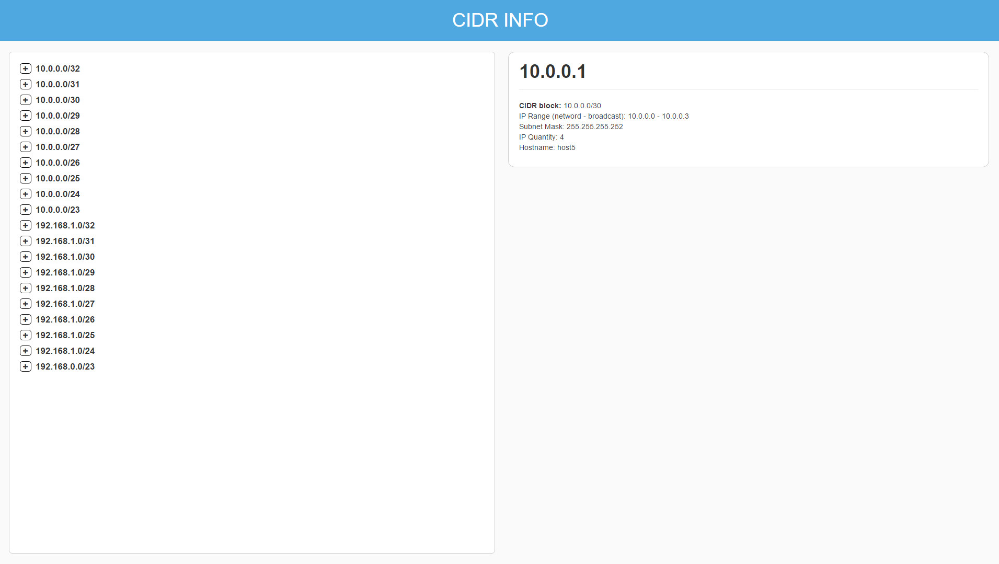

# angular_subnet_ui

### How to run application
* To install the dependencies, you will need to use 'npm install' from your terminal.
* If running for the first time, run 'npm run build'
* After installation is finished use 'ng serve' to run the app.
  * If 'ng serve'does not work, try 'npm start'
  * As an alternative to 'npm start', try running 'npm install -g @angular/cli@latest'. You should then be able to run 'ng' commands.
* Then open your browser and go to http://localhost:4200
* More details on the project README: https://github.com/alfonso1003/angular_subnet_ui/blob/master/cidr/README.md

### Packages used:
* Angular-CLI - to build the app
* Bootstrap 3.3.7 - for the grid system

